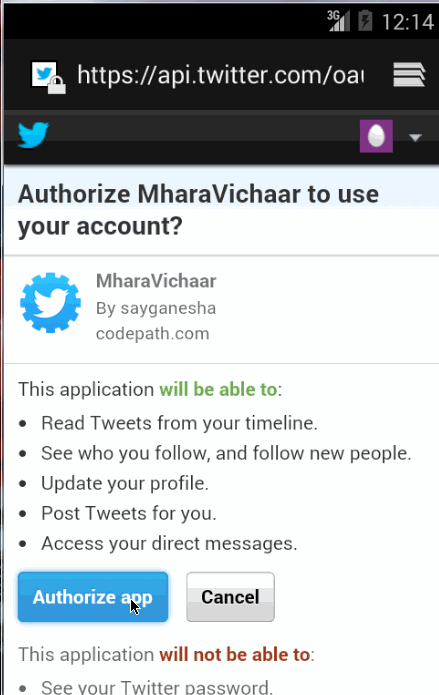

android-basic-twitter-client
============================

Basic Twitter client

Provides the following Stories:

- User can sign in to Twitter using OAuth login
- User can view the tweets from their home timeline
- User should be able to see the username, name, body and image for each tweet
- User should be displayed the relative timestamp for a tweet "8m", "7h"
- User can view more tweets as they scroll with infinite pagination
- User can compose a new tweet
- User can click a “Compose” icon in the Action Bar on the top right
- User can then enter a new tweet and post this to twitter
- User is taken back to home timeline with new tweet visible in timeline

Completed following optional stories
- Links in tweets are clickable and will launch the web browser (see autolink)
- User can see a counter with total number of characters left for tweet
- User can refresh tweets timeline by pulling down to refresh (i.e pull-to-refresh)
- Improved the user interface and theme the app to feel "twitter branded"
- Compose activity is replaced with a modal overlay

Missed - ActiveAndroid - couldnt get a stable app, but will continue to push once it is done.

GIF created with [LiceCap](http://www.cockos.com/licecap/).
